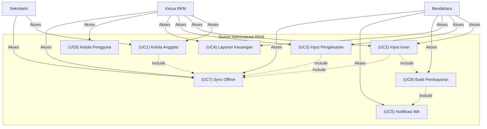
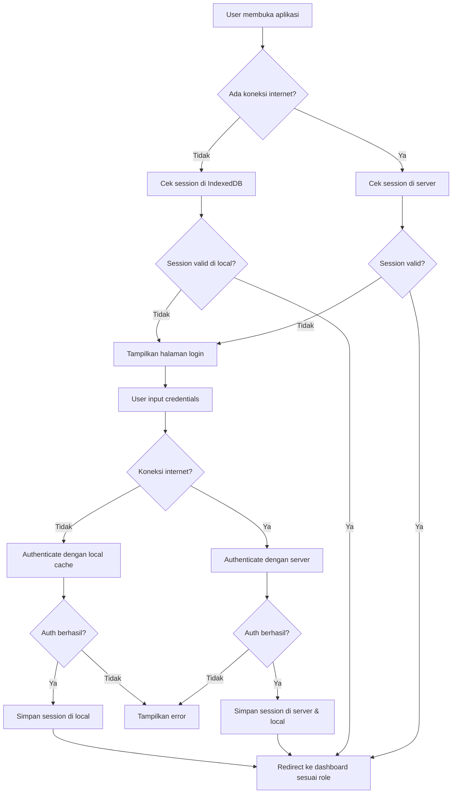
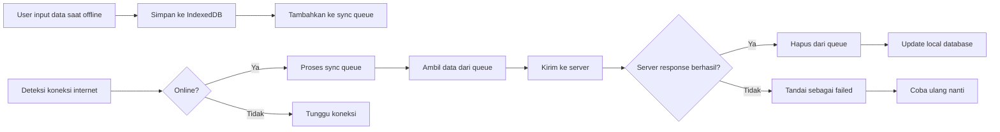
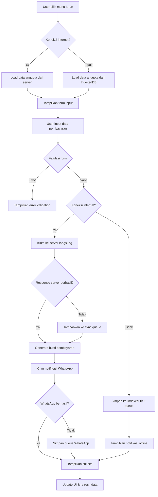
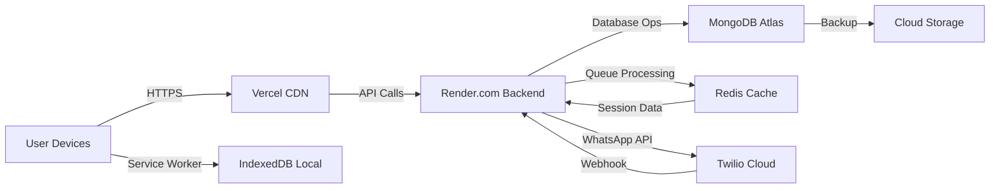

# SRS - Sistem Administrasi RKM (Rukun Kematian Muslim)

## 📋 Daftar Isi
- [1. Pendahuluan](#1-pendahuluan)
- [2. Deskripsi Proyek](#2-deskripsi-proyek)
- [3. Techstack yang Digunakan](#3-techstack-yang-digunakan)
- [4. Use Case Diagram](#4-use-case-diagram)
- [5. Alur Aplikasi](#5-alur-aplikasi)
- [6. Requirement Fungsional](#6-requirement-fungsional)
- [7. Requirement Non-Fungsional](#7-requirement-non-fungsional)
- [8. Database Schema](#8-database-schema)
- [9. Flowchart Utama](#9-flowchart-utama)
- [10. Offline Strategy](#10-offline-strategy)
- [11. Deployment Plan](#11-deployment-plan)
- [12. Timeline Development](#12-timeline-development)

---

## 1. Pendahuluan

### 1.1 Tujuan Dokumen
Dokumen ini bertujuan untuk mendefinisikan kebutuhan fungsional dan non-fungsional dari sistem administrasi RKM, termasuk spesifikasi teknis, alur kerja, dan strategi implementasi dengan dukungan PWA dan offline mode.

### 1.2 Ruang Lingkup
Sistem administrasi RKM mencakup:
- Manajemen data anggota
- Pencatatan pembayaran iuran bulanan
- Pencatatan pengeluaran operasional
- Pelaporan keuangan
- Dukungan PWA dengan offline mode menggunakan IndexedDB
- Integrasi WhatsApp untuk notifikasi dan bukti pembayaran

### 1.3 Target Pengguna
- **Ketua RKM**: Akses penuh ke semua fitur dan laporan
- **Bendahara**: Manajemen keuangan (pemasukan & pengeluaran), laporan keuangan
- **Sekretaris**: Manajemen data anggota, input data dasar

---

## 2. Deskripsi Proyek

### 2.1 Nama Aplikasi
**RKM Admin - Sistem Manajemen Rukun Kematian Muslim**

### 2.2 Visi
Membangun sistem administrasi yang handal, dapat diakses offline, dan mudah digunakan untuk mengelola keanggotaan dan keuangan RKM secara transparan.

### 2.3 Misi
- Menyediakan platform terpusat untuk administrasi keanggotaan
- Memudahkan pencatatan dan pelaporan keuangan
- Menjamin ketersediaan sistem bahkan tanpa koneksi internet
- Mengotomatisasi notifikasi dan bukti pembayaran melalui WhatsApp

---

## 3. Techstack yang Digunakan

### 3.1 Frontend
| Teknologi | Versi | Kegunaan |
|-----------|-------|----------|
| React.js | 18.2.0 | Framework utama aplikasi |
| Vite | 4.0.0 | Build tool & development server |
| Redux Toolkit | 1.9.0 | State management (offline/online) |
| React Router | 6.8.0 | Navigation & routing |
| Workbox | 6.5.0 | PWA service workers & caching |
| localForage | 1.10.0 | IndexedDB wrapper |
| Axios | 1.2.0 | HTTP client dengan interceptor |
| Chart.js | 4.2.0 | Visualisasi laporan keuangan |
| Tailwind CSS | 3.2.0 | Styling & responsive design |
| React Hook Form | 7.43.0 | Form validation |
| PDF-Lib | 1.17.0 | Generate PDF reports |

### 3.2 Backend
| Teknologi | Versi | Kegunaan |
|-----------|-------|----------|
| Node.js | 18.12.0 | Runtime environment |
| Express.js | 4.18.2 | Web framework |
| MongoDB | 6.0 | Database utama |
| Mongoose | 7.0.0 | ODM (Object Data Modeling) |
| JWT | 9.0.0 | Authentication & authorization |
| Socket.io | 4.6.0 | Real-time sync notifications |
| Bull | 4.8.0 | Queue management untuk background jobs |
| Twilio | 3.80.0 | WhatsApp API integration |
| Nodemailer | 6.8.0 | Email notifications fallback |

### 3.3 Database
| Jenis | Teknologi | Kegunaan |
|-------|-----------|----------|
| Online | MongoDB Atlas | Database utama cloud-based |
| Offline | IndexedDB | Local storage untuk offline mode |
| Cache | Redis | Session management & caching |

### 3.4 DevOps & Deployment
| Kategori | Teknologi | Kegunaan |
|----------|-----------|----------|
| Hosting Frontend | Vercel | PWA deployment dengan CDN |
| Hosting Backend | Render.com | Node.js server dengan auto-scaling |
| Database | MongoDB Atlas | Cloud database dengan backup |
| Monitoring | Sentry | Error tracking & performance monitoring |
| Version Control | GitHub | Code repository & CI/CD |
| Testing | Jest + React Testing Library | Unit & integration testing |

---

## 4. Use Case Diagram



### Penjelasan Use Case:
- **Ketua RKM**: Akses penuh ke semua fitur, termasuk manajemen pengguna
- **Bendahara**: Fokus pada keuangan (iuran & pengeluaran), laporan keuangan, bukti pembayaran, dan notifikasi
- **Sekretaris**: Manajemen data anggota dan sinkronisasi offline

---

## 5. Alur Aplikasi

### 5.1 Alur Login & Authentication


### 5.2 Alur Sync Data Offline-Online


---

## 6. Requirement Fungsional

### 6.1 Modul Manajemen Anggota
**RF-MA-001**: Input Data Anggota
- Field wajib: Tanggal daftar, No KK, No urut RKM, Nama KK, Nama istri, No HP, Alamat lengkap, Nama tertanggung, Jumlah tanggungan
- Validasi format data (tanggal, nomor HP, dll)
- Generate nomor anggota otomatis
- Simpan ke database online & offline

**RF-MA-002**: Lihat Daftar Anggota
- Tabel dengan pagination & search
- Filter berdasarkan status aktif/tidak
- Ekspor ke Excel/PDF
- Tampilkan detail anggota

### 6.2 Modul Keuangan - Pemasukan
**RF-KP-001**: Input Pembayaran Iuran
- Pilih anggota dari daftar
- Pilih bulan iuran
- Input nominal pembayaran
- Generate bukti pembayaran otomatis
- Kirim notifikasi WhatsApp ke anggota

**RF-KP-002**: Laporan Pemasukan
- Rekap per bulan/tahun
- Grafik visualisasi
- Filter berdasarkan periode
- Detail transaksi per anggota
- Saldo iuran per anggota

### 6.3 Modul Keuangan - Pengeluaran
**RF-KG-001**: Input Pengeluaran
- Kategori pengeluaran: Kain kafan, Memandikan, Transportasi, Alat tulis, Lain-lain
- Input detail biaya
- Upload bukti foto (opsional)
- Catat tanggal & keterangan

**RF-KG-002**: Laporan Pengeluaran
- Rekap per kategori
- Rekap per bulan
- Grafik perbandingan pemasukan vs pengeluaran
- Neraca keuangan per bulan

### 6.4 Modul PWA & Offline
**RF-PWA-001**: Installable Web App
- Tampilkan prompt install saat user mengunjungi beberapa kali
- Icon aplikasi di home screen
- Splash screen saat loading

**RF-PWA-002**: Offline Mode
- Semua fitur CRUD berfungsi offline
- Data tersimpan di IndexedDB
- Auto-sync saat koneksi kembali
- Tampilkan status koneksi di UI

### 6.5 Modul Notifikasi
**RF-NOTIF-001**: WhatsApp Integration
- Kirim bukti pembayaran otomatis
- Kirim reminder pembayaran iuran
- Format pesan yang user-friendly
- Fallback ke email jika WhatsApp gagal

---

## 7. Requirement Non-Fungsional

### 7.1 Performance
- **NFR-PERF-001**: Waktu loading halaman maksimal 3 detik saat online
- **NFR-PERF-002**: Operasi CRUD offline maksimal 1 detik
- **NFR-PERF-003**: Sync data background tidak mengganggu UI

### 7.2 Security
- **NFR-SEC-001**: Enkripsi data sensitif di local storage
- **NFR-SEC-002**: JWT token dengan expiration time 1 jam
- **NFR-SEC-003**: Rate limiting untuk API endpoints
- **NFR-SEC-004**: Role-based access control (RBAC)

### 7.3 Usability
- **NFR-USAB-001**: UI responsive untuk mobile & desktop
- **NFR-USAB-002**: Navigasi intuitif dengan minimal 3 klik ke fitur utama
- **NFR-USAB-003**: Dark mode support
- **NFR-USAB-004**: Aksesibilitas (WCAG compliant)

### 7.4 Reliability
- **NFR-RELI-001**: Data tidak hilang saat aplikasi crash
- **NFR-RELI-002**: Auto-retry sync mechanism
- **NFR-RELI-003**: Conflict resolution untuk data yang berubah
- **NFR-RELI-004**: Backup harian database

### 7.5 Maintainability
- **NFR-MAINT-001**: Documented code dengan 80%+ coverage
- **NFR-MAINT-002**: Modular architecture
- **NFR-MAINT-003**: Environment variables untuk konfigurasi
- **NFR-MAINT-004**: Logging terpusat

---

## 8. Database Schema

### 8.1 MongoDB Schema (Online)
```javascript
// User Schema
{
  _id: ObjectId,
  username: String (unique),
  password: String (hashed),
  role: ['ketua', 'bendahara', 'sekretaris'],
  name: String,
  phone: String,
  createdAt: Date,
  lastLogin: Date,
  syncToken: String // untuk offline sync
}

// Member Schema
{
  _id: ObjectId,
  registrationDate: Date,
  kkNumber: String,
  memberNumber: String (RKM-YYYY-001),
  headName: String,
  wifeName: String,
  phone: String,
  address: {
    street: String,
    kelurahan: String,
    kecamatan: String,
    kabupaten: String
  },
  beneficiaryName: String,
  dependentsCount: Number,
  status: ['active', 'inactive'],
  createdAt: Date,
  updatedAt: Date
}

// Payment Schema
{
  _id: ObjectId,
  memberId: ObjectId (ref: Member),
  paymentDate: Date,
  month: String (YYYY-MM),
  amount: Number,
  receiptNumber: String,
  proofImage: String (URL),
  syncStatus: ['pending', 'synced', 'failed'],
  offlineId: String // untuk identifikasi offline
}

// Expense Schema
{
  _id: ObjectId,
  date: Date,
  category: ['kain_kafan', 'memandikan', 'transportasi', 'alat_tulis', 'lain_lain'],
  amount: Number,
  description: String,
  proofImage: String (URL),
  createdBy: ObjectId (ref: User),
  syncStatus: ['pending', 'synced', 'failed'],
  offlineId: String
}
```

### 8.2 IndexedDB Schema (Offline)
```javascript
// Database Name: rkm_offline_db
// Version: 1

// Stores:
1. users (offline cache)
   - id (string)
   - username (string)
   - role (string)
   - token (string)
   - lastSync (date)

2. members
   - id (string) // offlineId
   - data (object) // full member data
   - syncStatus ('pending', 'synced')
   - createdAt (date)

3. payments
   - id (string) // offlineId
   - data (object) // full payment data
   - syncStatus ('pending', 'synced', 'failed')
   - createdAt (date)

4. expenses
   - id (string) // offlineId
   - data (object) // full expense data
   - syncStatus ('pending', 'synced', 'failed')
   - createdAt (date)

5. sync_queue
   - id (string) // unique queue ID
   - operation ('create', 'update', 'delete')
   - entityType ('member', 'payment', 'expense')
   - entityId (string) // offlineId or server ID
   - data (object) // data to sync
   - priority (number) // 1=highest
   - attempts (number) // retry count
   - createdAt (date)
   - nextAttempt (date)
```

---

## 9. Flowchart Utama

### 9.1 Flowchart Input Pembayaran Iuran


---

## 10. Offline Strategy

### 10.1 Sync Mechanism
**Strategi: Optimistic UI dengan Eventual Consistency**
- User interaction langsung merespons UI
- Data disimpan di IndexedDB terlebih dahulu
- Background sync mengirim data ke server
- Conflict resolution berbasis timestamp terakhir

### 10.2 Data Priority Levels
| Priority | Data Type | Sync Frequency | Conflict Resolution |
|----------|-----------|----------------|---------------------|
| 1 (High) | Transaksi Keuangan | Immediate on online | Server wins |
| 2 (Medium) | Data Anggota | Every 5 minutes | Manual merge |
| 3 (Low) | Master Data | Daily | Server wins |

### 10.3 Conflict Resolution Rules
1. **Last Write Wins**: Data dengan timestamp terbaru yang menang
2. **Server Priority**: Untuk data kritis (keuangan), data server lebih diprioritaskan
3. **Manual Merge**: Untuk data anggota, tampilkan perbandingan dan biarkan user memilih
4. **Data Loss Prevention**: Selalu backup data sebelum overwrite

### 10.4 Offline UI States
- **Status Bar**: Warna merah saat offline, hijau saat online
- **Sync Indicator**: Animation saat sedang sync
- **Queue Status**: Jumlah item menunggu sync
- **Offline Warning**: Tooltip pada tombol yang membutuhkan internet

---

## 11. Deployment Plan

### 11.1 Infrastructure Diagram


### 11.2 Environment Setup
| Environment | URL | Database | Auto-deploy |
|-------------|-----|----------|-------------|
| Development | localhost:3000 | localhost:27017 | Manual |
| Staging | staging.rkm-admin.vercel.app | MongoDB Atlas Staging | GitHub Push |
| Production | rkm-admin.vercel.app | MongoDB Atlas Production | GitHub Release |

### 11.3 Security Measures
- **HTTPS** wajib di semua environment
- **Environment Variables** untuk secrets (API keys, DB credentials)
- **CORS Policy** ketat hanya untuk domain terdaftar
- **Input Sanitization** di semua API endpoints
- **Rate Limiting**: 100 requests/minute per user

---

## 12. Timeline Development

### 12.1 Phase 1: Foundation (2 Minggu)
| Week | Tasks | Deliverables |
|------|-------|--------------|
| 1 | - Setup project structure<br>- Basic authentication<br>- PWA setup<br>- IndexedDB initialization | - Working PWA shell<br>- Login functionality<br>- Basic offline detection |
| 2 | - Role-based routing<br>- User management module<br>- Sync queue implementation<br>- Basic member CRUD | - RBAC system<br>- Offline data storage<br>- Working member management |

### 12.2 Phase 2: Core Features (3 Minggu)
| Week | Tasks | Deliverables |
|------|-------|--------------|
| 3 | - Payment module development<br>- WhatsApp API integration<br>- Receipt generation<br>- Offline payment handling | - Working payment system<br>- WhatsApp notifications<br>- PDF receipts |
| 4 | - Expense module development<br>- Financial reporting<br>- Charts integration<br>- Sync conflict resolution | - Expense tracking<br>- Financial reports<br>- Data visualization |
| 5 | - Comprehensive testing<br>- Bug fixing<br>- Performance optimization<br>- Documentation | - Test coverage report<br>- Optimized PWA<br>- User manual |

### 12.3 Phase 3: Deployment & Maintenance (1 Minggu)
| Week | Tasks | Deliverables |
|------|-------|--------------|
| 6 | - Production deployment<br>- User training<br>- Monitoring setup<br>- Maintenance plan | - Live production system<br>- Training materials<br>- Monitoring dashboard |

### 12.4 Resource Allocation
| Role | Hours/Week | Total Hours |
|------|------------|-------------|
| Frontend Developer | 20 | 120 |
| Backend Developer | 20 | 120 |
| UI/UX Designer | 10 | 60 |
| QA Tester | 10 | 60 |
| Project Manager | 5 | 30 |
| **Total** | **65** | **390** |

---

## 📞 Kontak & Support
- **Project Manager**: [Nama PM]
- **Technical Lead**: [Nama Tech Lead]
- **Support Email**: support@rkm-admin.id
- **Emergency Hotline**: +62 812-3456-7890

## 📄 License
Aplikasi ini dikembangkan di bawah lisensi MIT untuk keperluan internal RKM. Hak cipta dilindungi undang-undang.

## 🔄 Revision History
| Version | Date | Author | Changes |
|---------|------|--------|---------|
| 1.0.0 | 22 Desember 2025 | System Analyst | Initial SRS Document |
| 1.0.1 | 23 Desember 2025 | Technical Lead | Added offline strategy details |